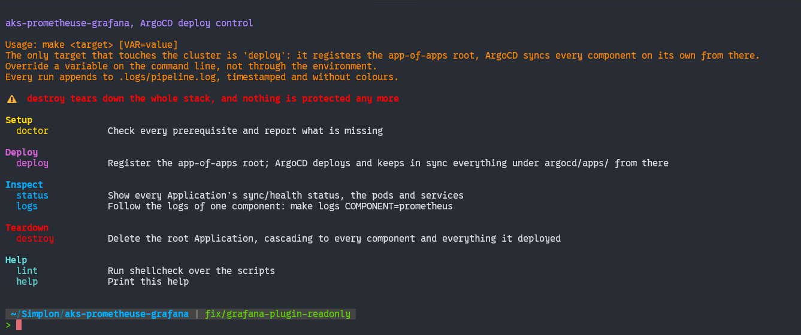
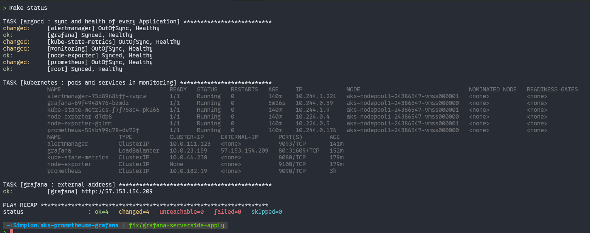
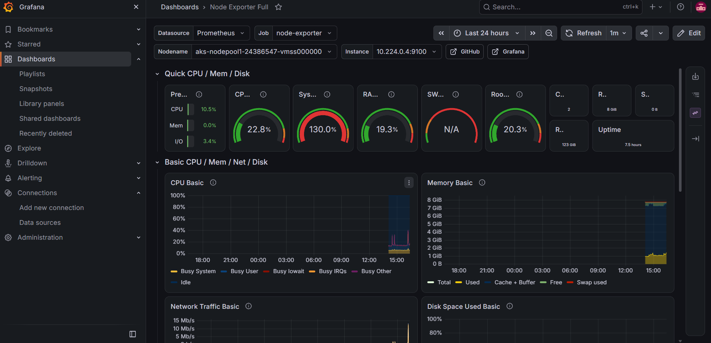

<br/>

<p align="center">
  
</p>

<h1 align="center">Cluster Monitoring with Prometheus, Grafana and ArgoCD</h1>

<p align="center">
  <i>Prometheus, Alertmanager and Grafana deployed on AKS with raw Kubernetes manifests, no Helm chart, no operator, kept in sync by ArgoCD</i>
</p>

<p align="center"><sub>Contributors</sub></p>

<p align="center">
  <a href="https://github.com/WhiteMuush"></a>
  <a href="https://github.com/bambstk"></a>
</p>

<br/>

---

<br/>

## The stack

Five components in the `monitoring` namespace, one manifest set per component under [`manifests/`](manifests).

| Component | Role |
| --- | --- |
| `prometheus` | Scrapes the targets below, stores the series, answers PromQL |
| `alertmanager` | Routes the alerts Prometheus fires |
| `grafana` | Reads Prometheus and draws it |
| `node-exporter` | One pod per node, reads the machine itself |
| `kube-state-metrics` | Reads the Kubernetes API, exposes the state of pods, deployments, nodes |

No Helm chart, no operator: every object is a plain YAML file, readable without knowing either.

<br/>

---

<br/>

## GitOps

[`argocd/`](argocd) holds one ArgoCD Application per component, plus an app-of-apps root that registers them all. Automated sync and self-heal are set on every one: pushing to `main` is the actual deploy mechanism, ArgoCD reconciles the cluster to match it on its own.

```bash
kubectl create secret generic grafana-admin \
  --namespace monitoring \
  --from-literal=admin-password='<your-password>'

make deploy
```

There is no "redeploy" target. `make deploy` only registers the root once; from there, changing a manifest and pushing is the whole workflow.

<br/>

---

<br/>

## The Makefile

[`Makefile`](Makefile) and [`scripts/pipeline/`](scripts/pipeline) report in the vocabulary of Ansible: `ok`, `changed`, `skipping`, `unreachable`, `fatal`, so a second run proves idempotence instead of just claiming it.

<p align="center">
  
</p>

<br/>

---

<br/>

## Status

```bash
make status
```

<p align="center">
  
</p>

<br/>

---

<br/>

## Dashboards

Grafana's Prometheus datasource is provisioned as code, not clicked together, see [`manifests/grafana/`](manifests/grafana). The node dashboard is the official [Node Exporter Full](https://grafana.com/grafana/dashboards/1860-node-exporter-full/) (ID `1860`), provisioned the same way from [`dashboards/`](dashboards).

<p align="center">
  
</p>

<br/>

---

<br/>

<p align="center"><sub>Brief in <a href="docs/CONSIGNES.md">docs/CONSIGNES.md</a></sub></p>
